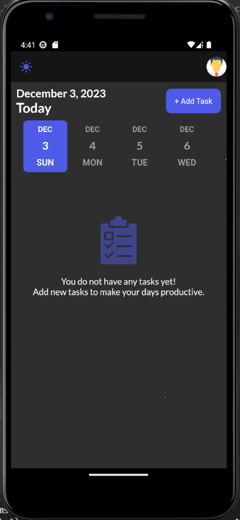
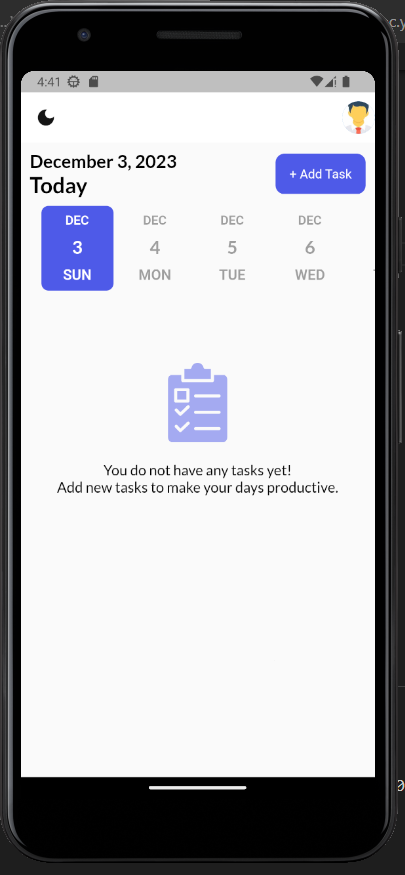
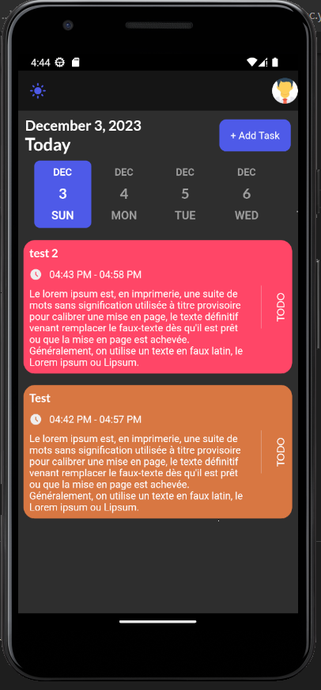
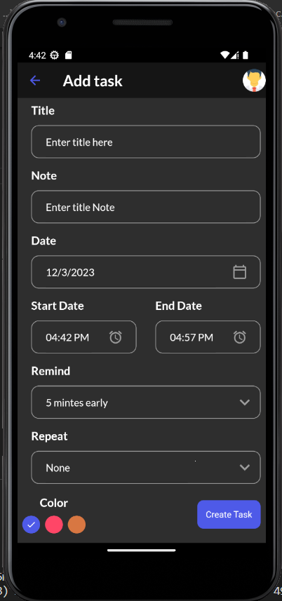
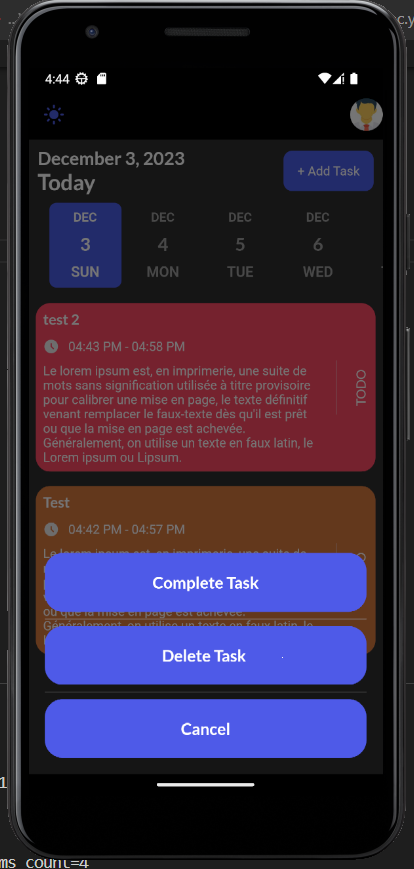

# TODO 

TODO, your personal productivity assistant! Here's what you can do:

Create a new task and add subtasks to track your progress.
Prioritize tasks using our simple yet effective prioritization system.
Mark tasks as complete once you've finished them.
Get reminded of upcoming tasks with our customizable local notifications.
Review your task history and improve your productivity with insights.
Enjoy My TODO, and never let a task slip through the cracks again!

## Getting Started

